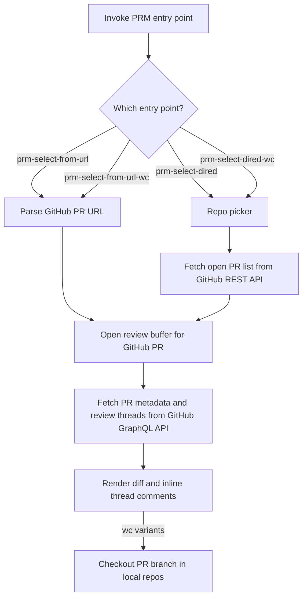

# PRM

PRM is an Emacs package for reviewing GitHub pull requests in a dired-like flow: pick a repo, open its open PRs, then jump into a threaded diff review buffer.

Only GitHub is supported.

## Main entry points

- `prm-select-dired`
- `prm-select-dired-wc`
- `prm-select-from-url`
- `prm-select-from-url-wc`

## Flow

## Local configuration

PRM loads [`.emacs-prm-locals.el`](.emacs-prm-locals.el) automatically at startup. It provides the machine-specific values the package needs to resolve repos and local checkouts.

| Setting | Used for |
| --- | --- |
| `prm-presets` | Repo picker labels and GitHub repo names |
| `prm-local-paths` | Mapping GitHub repos to local working copies |
| `prm-base-branch` | Base branch used for diffs when reviewing PRs |
| `prm-repo-path` | Fallback local repo path for diff commands |
| `prm-owner`, `prm-repo-prefix`, `prm-repo-suffix`, `prm-repo-name`, `prm-username` | Building a default repo name when needed |

If the locals file is missing or incomplete, review buffers and checkout-on-open behavior will not have enough information to resolve local repos.
