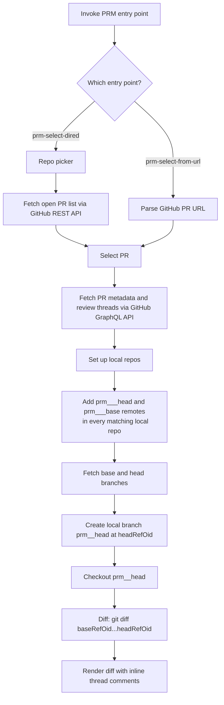

# PRM

PRM is an Emacs package for reviewing GitHub pull requests in a dired-like flow: pick a repo, open its open PRs, then jump into a threaded diff review buffer.

Only GitHub is supported.

## Main entry points

- `prm-select-dired` — repo picker → PR list → review buffer
- `prm-select-dired-wc` — same (kept for backwards compat, behavior identical)
- `prm-select-from-url` — jump directly to a review from a GitHub PR URL
- `prm-select-from-url-wc` — same (kept for backwards compat)

## Flow



The diff is always `baseRefOid...headRefOid` — the exact commits reported by the GitHub API at the time the PR was opened. This means:
- The base side is pinned to the commit the PR was opened against, not the current tip of the base branch.
- The head side is pinned to the latest commit on the PR branch.
- Only the PR author's changes appear (three-dot diff finds the merge base).

## Local configuration

PRM loads [`.emacs-prm-locals.el`](.emacs-prm-locals.el) automatically at startup. It provides the machine-specific values the package needs to resolve repos and local checkouts.

| Setting | Used for |
| --- | --- |
| `prm-presets` | Repo picker labels and GitHub repo names |
| `prm-local-paths` | Mapping GitHub repos to local working copies |
| `prm-base-branch` | Fallback base branch when GraphQL returns none |
| `prm-repo-path` | Fallback local repo path for diff commands |
| `prm-owner`, `prm-repo-prefix`, `prm-repo-suffix`, `prm-repo-name`, `prm-username` | Building a default repo name when needed |

If the locals file is missing or incomplete, review buffers will not have enough information to resolve local repos.

## Remote and branch naming

For each PR, PRM creates the following in every eligible local repo:

| Name | Type | Purpose |
| --- | --- | --- |
| `prm_<author>_<pr>_head` | remote | PR author's fork |
| `prm_<author>_<pr>_base` | remote | destination repo |
| `prm_<pr>_head` | local branch | pinned to `headRefOid` |

These accumulate over time. Run `M-x prm-cleanup` to remove all `prm_*` remotes and branches across every repo in `prm-local-paths`.

## Logging

All output is written to `*prm-log*` regardless of settings. `M-x prm-show-log` opens it.

Set `prm-verbose-log` to control minibuffer verbosity:

```elisp
(setq prm-verbose-log nil)   ; milestone messages only
(setq prm-verbose-log t)     ; all steps (default)
```

## Keybindings

### Repo Picker (`*prm-repos*`)

| Key | Command |
| --- | --- |
| `n` / `p` | Move to next/previous line |
| `RET` | Open PR list for repo |
| `g` | Refresh repo list |
| `?` | Show keybindings |

### PR List (`*prm-prs:<repo>*`)

| Key | Command |
| --- | --- |
| `n` / `p` | Move to next/previous line |
| `RET` | Open review buffer for PR |
| `g` | Refresh PR list |
| `?` | Show keybindings |

### Review Buffer (`*prm-review:<repo>#<number>*`)

| Key | Command |
| --- | --- |
| `n` / `p` | Move to next/previous thread |
| `t` | Create new thread at point |
| `r` | Reply to thread |
| `R` | Resolve thread |
| `g` | Refetch PR metadata and threads |
| `o` | Open file at point |
| `c` | Toggle comment visibility |
| `d` | Toggle diff visibility |
| `v` | Toggle resolved comment visibility |
| `?` | Show keybindings |
